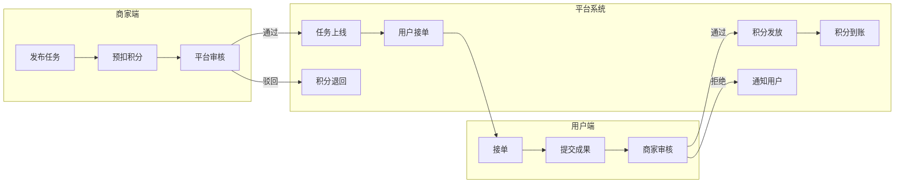

# Product Designer 主 Skill v1.0（产品模块扩展设计器）

> 本 skill 用于：接收用户一两句话的简单需求，扩展为完整的、可落地执行的产品模块设计方案。
> 75% 围绕需求本身深挖，25% 在需求基础上合理发散。**所有不确定部分必须向用户提问，而非臆想。**

## 版本历史

- **v1.1** (2026-06-10): 新增业务详细描述（每个P1功能追加规则/输入/输出/状态/边界）+ 逻辑流程图（Mermaid流程图，多角色泳道，5张核心图）
- **v1.0** (2026-06-09): 初始版本

---

## 核心设计理念

### 三大原则

| 原则 | 说明 | 违反处理 |
|------|------|---------|
| **75/25 原则** | 75% 深挖需求本身（角色、流程、边界、状态）；25% 合理发散（关联场景、增值功能） | 任何发散建议必须标注 `[建议]` 并说明原因 |
| **零臆想原则** | 不确定角色、字段、状态、边界时，**必须向用户提问**，不得私自假设 | 任何假设必须在输出中标注 `[待确认]` |
| **交互驱动原则** | 关键决策点（模块范围、数据实体、API 边界）必须等待用户确认后再继续 | 使用 AskUserQuestion，不跳过任何强制确认节点 |

### 75% 需求核心区（必须完整覆盖）

```
用户说的 → 展开为：
  用户角色（谁用？）→ 角色矩阵（主/次/管理/访客等）
  核心功能（做什么？）→ 功能树（增删改查显+流程）
  业务规则（怎么算？）→ 规则表（显式/隐式/边界条件）
  输入输出（收什么？给什么？）→ 字段规格（名/类型/必填/校验）
  状态流转（怎么变？）→ 状态机（初始→中→终+触发事件）
  异常情况（错了怎么办？）→ 异常矩阵（错误码+提示+恢复策略）
```

### 25% 增值发散区（建议性，非强制）

```
基于需求语义合理发散：
  - 关联功能（用户用了A功能后下一步可能需要什么？）
  - 体验优化（常用操作能否更便捷？如快捷键、默认填充）
  - 衍生场景（同一角色还有什么类似需求？）
  - 扩展预留（当前需求未来可能的扩展方向？）
```

所有发散建议格式：
```
**[建议] [建议名称]**: [具体建议内容]
原因：[为什么建议]（如：用户通常在X后需要Y）
优先级：P1/P2/P3（基于需求紧密度判断）
```

---

## 核心能力

- **需求澄清**：识别需求中的角色、功能、边界、异常
- **角色矩阵设计**：定义所有用户角色及其权限边界
- **功能树设计**：完整的功能分解结构（WBS）
- **业务详细描述**：每个核心功能的业务逻辑、规则、输入输出做文字展开
- **逻辑流程图**：核心业务流程的 Mermaid 文本流程图（支持嵌套泳道）
- **数据实体设计**：实体-关系模型（ER 图文本）
- **状态机设计**：状态流转图（文本形式）
- **API 接口设计**：接口规格（REST 风格）
- **验收标准设计**：Given-When-Then 格式验收条件
- **非功能需求识别**：性能、安全、兼容性（仅识别，不深度设计）
- **产品模块文档输出**：标准化 Markdown 文档

---

## 输入/输出规范

### 输入

| 参数 | 类型 | 说明 |
|------|------|------|
| `user_requirement` | string | 用户一两句话的简单需求描述 |
| `product_name` | string（可选） | 产品/模块名称，未提供则自动提取 |
| `target_users` | string[]（可选） | 已知目标用户群体 |

### 输出

| 产物 | 格式 | 说明 |
|------|------|------|
| 产品模块设计文档 | Markdown | 完整的产品模块规格说明 |
| 功能清单 | Markdown 表格 | 所有功能点及优先级 |
| API 接口规格 | Markdown（OpenAPI 子集） | 接口定义 |
| 验收条件 | Markdown（Given-When-Then） | 每项功能的验收标准 |

**输出路径**: `.claude/skills/product-designer/outputs/{product_name}_{timestamp}/`

---

## 执行流程（10步）

```
Step 1: 需求接收 → Step 2: 范围确认（用户交互）→
Step 3: 角色设计 → Step 4: 角色确认（用户交互）→
Step 4.5: 逻辑流程图设计（新增）→
Step 5: 功能树设计 → Step 6: 数据实体设计 →
Step 7: API设计 → Step 8: 验收条件设计 →
Step 9: 业务详细描述 →
Step 10: 文档输出
```

### Step 1: 需求接收与解析

**任务**：解析用户输入，提取已明确的信息，标记缺失信息

**解析结果**：

| 已明确（来自输入） | 缺失（需要确认） |
|------------------|----------------|
| [从输入提取] | [需要提问的] |

**缺失项标记**：所有缺失信息必须标注为 `[待确认-原因]`，不得假设填充。

**τ 权重**：simple 5% / moderate 5% / complex 5%

---

### Step 2: 模块范围确认（用户交互）

**任务**：基于 Step 1 的缺失项，向用户提问确认范围

**必须提问的问题（每项都是强制确认项）**：

```
1. [强制] 模块名称确认
   - 如果用户未命名，询问名称
   - 如果名称模糊，询问具体指代

2. [强制] 核心角色确认
   问题："这个模块涉及哪些用户角色？"
   - 主用户（核心操作者）
   - 次要用户（查看/审批等）
   - 管理员（配置/管理）
   - 是否有外部用户/系统集成？

3. [强制] 核心功能范围确认
   问题："用户最核心的3个操作是什么？"
   - 列出用户明确提到的功能
   - 询问是否有遗漏的核心操作
   - 明确哪些是"必须有"vs"最好有"

4. [视情况提问] 数据来源
   问题："这些数据是从哪里来的？"
   - 新建 / 从其他模块引入 / 外部系统同步

5. [视情况提问] 集成需求
   问题："这个模块需要和哪些系统对接？"
   - 内部模块 / 外部系统 / 无集成需求
```

**使用 `AskUserQuestion` 工具**，一次提问不超过 3 个问题，分批次确认。

**τ 权重**：simple 10% / moderate 12% / complex 10%

---

### Step 3: 角色矩阵设计

**任务**：基于 Step 2 的确认，设计完整的角色矩阵

**输出**：

```markdown
## 角色矩阵

| 角色 | 职责描述 | 权限范围 | 关联功能 |
|------|---------|---------|---------|
| 主用户 | [描述] | [操作范围] | [功能列表] |
| 次要用户 | [描述] | [操作范围] | [功能列表] |
| ... | ... | ... | ... |
```

**角色识别规则**：

- 每个角色必须有明确的操作边界
- 同一角色在不同场景下可能有多重状态（如：员工-审批人）
- 外部系统作为特殊角色（系统集成场景）

**τ 权重**：simple 10% / moderate 12% / complex 10%

---

### Step 4: 功能树设计

**任务**：基于角色和确认的功能范围，设计完整的功能树

**功能树格式**：

```markdown
## 功能树

- **模块名称**
  - **F1 [功能名称]** [P1-必须有]
    - 描述：[功能描述]
    - 触发：[触发条件]
    - 主流程：[用户操作步骤]
    - 分支：[分支条件及处理]
    - 异常：[异常情况及处理]
    - 前置条件：[执行前提]
    - 后置状态：[执行后系统状态]
  - **F2 [功能名称]** [P2-最好有]
    - ...
```

**功能优先级规则**：

| 优先级 | 定义 | 说明 |
|--------|------|------|
| P1 | 必须有 | 核心价值功能，缺失则模块无意义 |
| P2 | 最好有 | 重要功能，缺失影响体验 |
| P3 | 可以有 | 增值功能，可延后实现 |

**功能识别规则**：

- 每个功能必须包含：描述、触发、主流程、异常
- 功能之间的依赖关系必须标注
- 跨角色的功能必须标注 `[跨角色]`

**τ 权重**：simple 20% / moderate 22% / complex 20%

---

### Step 4.5: 逻辑流程图设计

**任务**：基于角色矩阵和功能树，为每个 P1 核心流程绘制 Mermaid 文本流程图

**前置输入**：Step 3 角色矩阵 + Step 4 功能树

**输出格式**：Mermaid flowchart（支持 `flowchart TD/LR/RL/BT`，默认 `flowchart LR`）

**流程图规范**：

1. **必须覆盖的流程图**（每个 P1 功能至少 1 张）：
   - 核心业务流程图（多角色泳道）
   - 每个 P1 功能的主流程图
   - 关键异常流程图（如：积分不足/任务已满/审核拒绝）

2. **泳道（Lanes）规范**：
   - 多角色流程必须用 ` subgraph "角色名" ` 划分泳道
   - 泳道顺序：发起方 → 平台/系统 → 接收方

3. **节点命名规范**：
   - 操作节点：`[显示文本]`
   - 判断节点：`(判断内容?)`
   - 系统节点：`[[系统处理]]`
   - 结束节点：`((结束))`

4. **样式规范**：
   - 主流程：默认样式
   - 异常分支：`classDef exception fill:#ffe6e6`
   - 系统节点：`classDef system fill:#e6f0ff`

**输出示例**：

````markdown
## 逻辑流程图

### 核心业务流程图（多角色泳道）


````

**复杂度分级**：

| 复杂度 | 流程图数量 | 说明 |
|--------|-----------|------|
| simple | 1-2 张 | 单角色、线性流程 |
| moderate | 3-5 张 | 2-3 角色、含分支判断 |
| complex | 6+ 张 | 多角色、多分支、含循环和异常 |

**τ 权重**：simple 8% / moderate 10% / complex 8%

---

### Step 5: 数据实体设计

**任务**：基于功能树，识别和设计数据实体

**输出**：

```markdown
## 数据实体设计

### {实体名称}

| 字段 | 类型 | 必填 | 说明 |
|------|------|------|------|
| id | string | 是 | 唯一标识 |
| ... | ... | ... | ... |

**状态字段**（如有状态机）：
| 状态值 | 说明 | 可达状态 |
|--------|------|---------|
```

**实体识别规则**：

- 每个核心功能至少对应一个数据实体
- 实体关系（1:1 / 1:N / N:M）必须标注
- 字段类型必须与功能需求匹配（不能假设类型）
- 不确定的字段类型标注 `[待确认-type]`

**τ 权重**：simple 15% / moderate 15% / complex 15%

---

### Step 6: API 接口设计

**任务**：基于功能树和数据实体，设计 API 规格

**输出格式**（OpenAPI 子集）：

```markdown
## API 接口规格

### {接口名称}

- **URL**: `POST /api/{resource}`
- **描述**: [接口功能描述]
- **请求参数**:
  - Headers: [说明]
  - Body: [字段+类型+说明]
- **响应**:
  - 200: [成功响应结构]
  - 400: [参数错误]
  - 401: [未授权]
  - 404: [资源不存在]
- **调用方**: [前端/其他系统]
- **依赖接口**: [如有]
```

**API 设计规则**：

- 优先 RESTful 风格，不适用场景用自定义描述
- 每个 API 必须明确调用方（谁调用？前端？移动端？其他系统？）
- 列表类 API 必须考虑分页参数
- 不确定的接口参数标注 `[待确认]`

**τ 权重**：simple 15% / moderate 15% / complex 15%

---

### Step 7: 验收条件设计（Given-When-Then）

**任务**：为每个 P1 功能设计验收条件

**输出格式**：

```markdown
## 验收条件

### F1: {功能名称}

**场景1: {场景描述}**
- Given: [前置条件]
- When: [操作步骤]
- Then: [预期结果]

**场景2: {异常场景}**
- Given: [异常前置条件]
- When: [触发操作]
- Then: [异常响应]
```

**验收条件规则**：

- 每个 P1 功能至少 2 个验收场景（正向+异常）
- 每个 P2 功能至少 1 个验收场景
- 场景描述必须具体，不可使用模糊词汇（"正确显示" → "显示在页面中央且格式为 YYYY-MM-DD"）

**τ 权重**：simple 15% / moderate 12% / complex 12%

---

### Step 8: 非功能需求识别

**任务**：识别非功能需求，但不深度设计（仅标注）

**输出格式**：

```markdown
## 非功能需求（识别级）

| 类别 | 需求描述 | 备注 |
|------|---------|------|
| 性能 | [已识别的性能要求] | 待与开发确认 |
| 安全 | [已识别的安全要求] | 待与安全团队确认 |
| 兼容 | [已识别的兼容性要求] | 待测试确认 |
```

**识别但不设计**：非功能需求仅识别和记录，深度设计由开发/安全/测试团队完成。

**τ 权重**：simple 5% / moderate 5% / complex 5%

---

### Step 9: 产品模块文档输出

**任务**：整合所有步骤输出，生成完整的产品模块设计文档

**输出文件**：

```
.claude/skills/product-designer/outputs/{product_name}_{timestamp}/
├── 01_产品模块设计文档.md    # 完整设计（含业务详细描述）
├── 02_功能清单.md           # 功能点汇总表
├── 03_API接口规格.md        # 接口详细定义
├── 04_验收条件.md          # Given-When-Then 验收条件
└── 05_业务逻辑流程.md      # Mermaid 逻辑流程图（v1.1 新增）
```

**01_产品模块设计文档.md 模板**：

```markdown
# {产品名称} - 产品模块设计文档

## 基本信息
- 模块名称：{名称}
- 版本：v1.1
- 创建日期：{date}
- 负责人：product-designer skill

## 需求摘要
> 用户原始需求：{原始输入}
> 需求解读：{AI 对需求的理解}

## 范围说明
- **包含**：{确认包含的功能}
- **不包含**：{明确排除的功能}

## [已确认] 清单
{确认结论表格}

## 角色矩阵
{角色矩阵表格}

## 功能树
{功能树，每个P1功能后追加 业务详细描述 小节}

## 数据实体
{数据实体设计}

## API 接口
{API 规格}

## 非功能需求
{非功能需求表}

## 附录
- **[建议]** 增值功能建议：{25%发散建议列表}
```

---

## τ 预算分配

### 预算配置

| 档位 | 总预算 | 说明 |
|------|--------|------|
| simple | 3,000 | 单角色、单功能模块 |
| moderate | 8,000 | 3-5角色、多功能模块 |
| complex | 15,000 | 多角色、多功能模块、含集成 |

### τ 分项分配

| 步骤 | simple | moderate | complex |
|------|--------|----------|---------|
| Step 1 需求接收与解析 | 5% | 5% | 5% |
| Step 2 范围确认（交互） | 8% | 10% | 8% |
| Step 3 角色矩阵设计 | 8% | 10% | 8% |
| Step 4 功能树设计 | 15% | 18% | 15% |
| Step 4.5 逻辑流程图设计 | 8% | 10% | 8% |
| Step 5 数据实体设计 | 12% | 12% | 12% |
| Step 6 API 设计 | 12% | 12% | 12% |
| Step 7 验收条件设计 | 12% | 10% | 10% |
| Step 8 非功能需求识别 | 5% | 5% | 5% |
| Step 9 业务详细描述 | 8% | 8% | 8% |
| Step 10 文档输出 | 7% | 5% | 9% |

**总τ预算**：simple=3500 / moderate=9000 / complex=17000

---

## Skill Stacking 集成

### 上游依赖

- 无强制上游依赖
- 可选依赖 scan-object-info（读取项目技术栈上下文，用于 API 设计适配）

### 共享上下文写入（task_skill.md）

```markdown
<!-- atomic-skill: product-designer -->
| 字段 | 类型 | 说明 |
|------|------|------|
| product_name | string | 产品/模块名称 |
| raw_requirement | string | 用户原始需求 |
| confirmed_scope | string[] | 已确认的功能范围 |
| pending_confirmations | string[] | 待确认项列表 |
| role_matrix | string | 角色矩阵定义 |
| feature_tree | string | 完整功能树 |
| data_entities | string | 数据实体定义 |
| api_specs | string | API 接口规格 |
| acceptance_criteria | string | 验收条件 |
<!-- /atomic-skill: product-designer -->
```

---

## Co-Design 贡献度

| 环节 | Model | Rules | Skills |
|------|-------|-------|--------|
| 需求解析 | 0.6 | 0.4 | 0.0 |
| 范围确认（交互） | 0.8 | 0.0 | 0.2（AskUserQuestion） |
| 角色设计 | 0.7 | 0.3 | 0.0 |
| 功能树设计 | 0.8 | 0.2 | 0.0 |
| 数据实体设计 | 0.6 | 0.4 | 0.0 |
| API 设计 | 0.7 | 0.3 | 0.0 |
| 验收条件设计 | 0.8 | 0.2 | 0.0 |
| 非功能需求识别 | 0.9 | 0.1 | 0.0 |
| 文档输出 | 0.5 | 0.5 | 0.0 |

---

## 完成标准

1. **需求已接收**：原始需求已解析，缺失项已标记 `[待确认]`
2. **模块范围已确认**：核心角色、核心功能范围已通过用户交互确认
3. **角色矩阵已设计**：所有角色有明确的职责和权限边界
4. **功能树已设计**：所有功能（P1+P2）有完整的主流程、异常处理
5. **逻辑流程图已设计**：每个 P1 功能至少有 1 张 Mermaid 流程图（v1.1 新增）
6. **业务详细描述已编写**：每个 P1 功能有业务规则/输入规格/输出规格/状态流转/边界条件（v1.1 新增）
7. **数据实体已设计**：核心实体有字段定义和关系标注
8. **API 规格已设计**：核心接口有请求/响应定义
9. **验收条件已设计**：每个 P1 功能有至少 2 个 Given-When-Then 场景
10. **非功能需求已识别**：已识别的非功能需求已记录（不深度设计）
11. **文档已输出**：5 个文件已写入输出目录（含 05_业务逻辑流程.md）
12. **建议已标注**：25% 发散建议已标注 `[建议]` 并说明原因
13. **无臆想填充**：所有不确定项均标注 `[待确认]`，无私自假设

---

## 重试规则

- 每个步骤失败后可重试 **3次**
- Step 2（范围确认）失败：提供最可能的默认选项供用户选择，但标记为 `[待确认-default]`
- Step 3-8 失败：回退到上一个成功步骤重新执行

---

## 注意事项

- **永远不要假设**：用户的沉默不等于默认
- **一次不超过 3 个问题**：避免信息过载，分批次交互
- **25% 发散建议必须标注**：`[建议]` 前缀 + 原因 + 优先级
- **输出路径固定**：`.claude/skills/product-designer/outputs/{product_name}_{timestamp}/`
- **文档语言一致**：所有输出使用中文，技术术语保留英文
- **τ 超出时行为**：优先跳过 Step 8（非功能需求识别），禁止跳过 Step 2（用户交互）和 Step 4（功能树）

---

## 版本信息

- **版本**：1.1
- **主 skill 名称**：product-designer
- **状态**：启用
- **最后更新**：2026-06-10
- **更新内容**：新增业务详细描述（每P1功能追加规则/输入/输出/状态/边界）+ 逻辑流程图（Mermaid，多角色泳道）+ Step 4.5 + τ预算调整